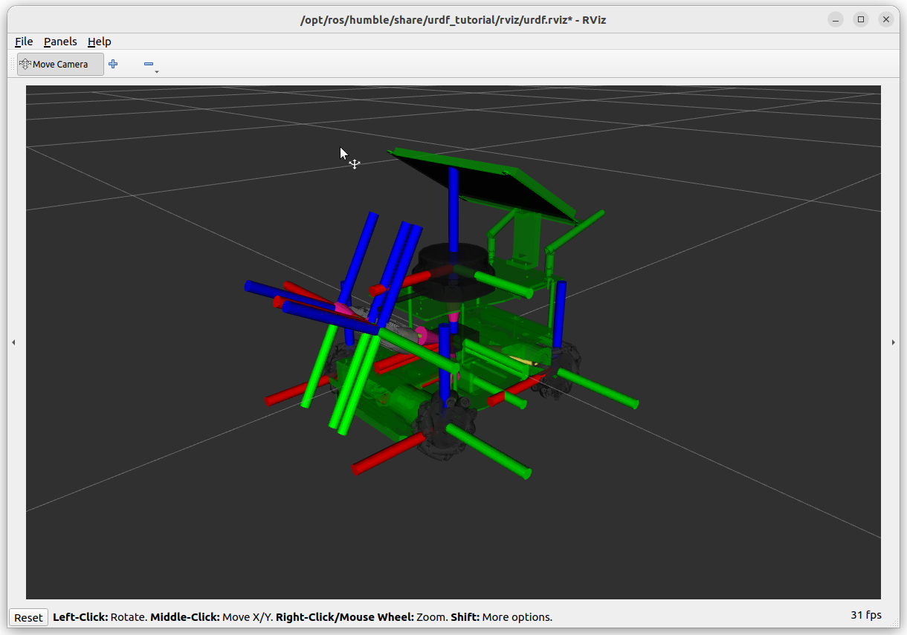

# yahboom_rosmaster #

This is an attempt to build and visualize a [Yahboom](https://github.com/YahboomTechnology/ROSMASTERX3) mobile robot with URDF in ROS2 Humble following [Automatic Addison's Tutorial](https://automaticaddison.com/create-and-visualize-a-mobile-robot-with-urdf-ros-2-jazzy/).

Next step is running simualtion in Gazebo.

What I learnt:

1. Mesh files - makes your robot look realistic in simulation. Typically in formats such as STL. One which is used in 3D printing and designed using CAD programs.

2. URDF files are created in XACRO formats which are like blueprints. If XACRO is the architect drawing up plans, URDF is the ready-to-use construction document. XACRO offers more flexibility and organization. But XACRO must be translated into compatible URDF format for ROS.

3. How modular components are defined, parameterized,  and then clubbed together into one robot model.

4. Needed to add this `sudo apt-get install ros-${ROS_DISTRO}-urdf-tutorial` and could visualize the model with `ros2 launch urdf_tutorial display.launch.py model:=/~{workspace}~/src/yahboom_rosmaster/yahboom_rosmaster_description/urdf/robots/rosmaster_x3.urdf.xacro`

5. Next I added ros2 control packages, but the example doesn't seem to work. Need to look into it. 